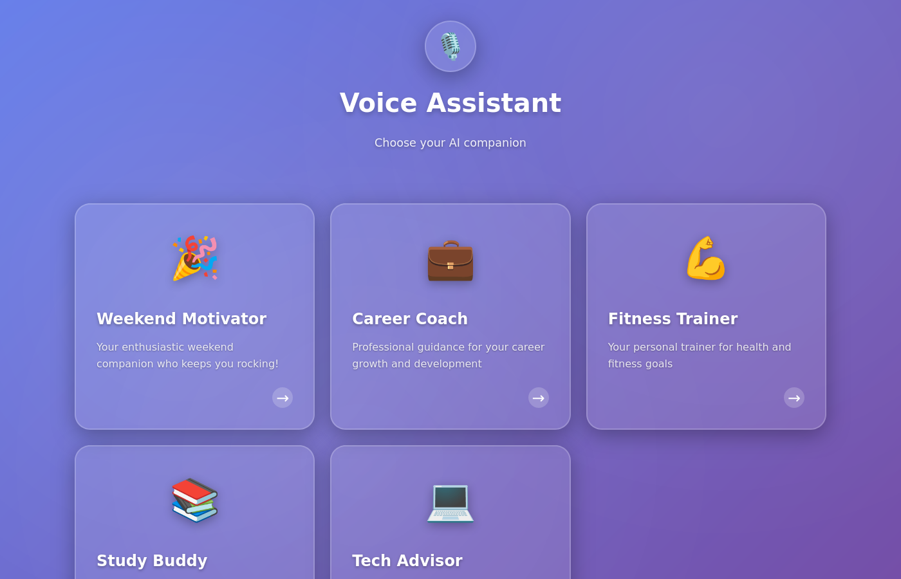
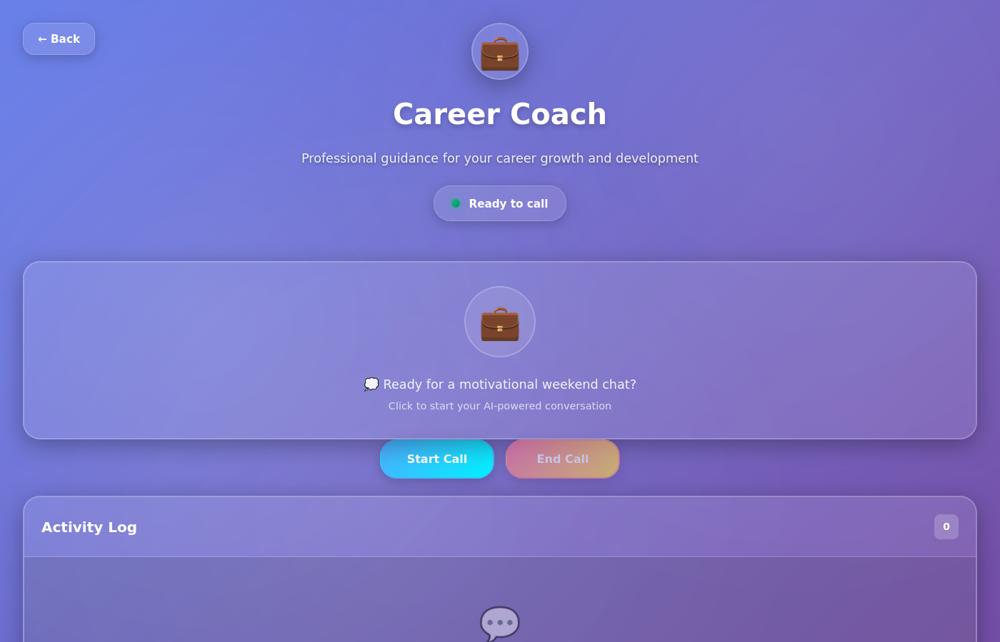

# Multiple Personas Feature

This document describes the multiple personas/assistants feature that allows users to select different AI personalities to call.

## Overview

The application now supports multiple personas (assistants) that users can choose from. Each persona has:
- Unique personality and system instructions
- Different voice characteristics
- Custom icon and description
- Specialized domain knowledge

## User Interface

### Persona Selection Screen
When users open the application, they are presented with a persona selection screen:



The screen displays:
- All available personas in a card grid layout
- Each card shows the persona's icon, name, and description
- Hover effects and animations for better user experience
- Responsive design that works on mobile and desktop

### Voice Assistant Screen
After selecting a persona, users are taken to the voice assistant screen:



The screen shows:
- Selected persona's icon and details in the header
- Back button to return to persona selection
- Call controls (Start Call, End Call)
- Activity log for conversation tracking
- Current connection status

## Default Personas

The application comes with 5 pre-configured personas:

1. **Weekend Motivator** 🎉
   - Voice: alloy
   - Focus: Enthusiasm and weekend motivation
   - Languages: Norwegian, English

2. **Career Coach** 💼
   - Voice: echo
   - Focus: Professional career guidance
   - Languages: Norwegian, English

3. **Fitness Trainer** 💪
   - Voice: fable
   - Focus: Health and fitness goals
   - Languages: Norwegian, English

4. **Study Buddy** 📚
   - Voice: nova
   - Focus: Learning and education support
   - Languages: Norwegian, English

5. **Tech Advisor** 💻
   - Voice: onyx
   - Focus: Technical expertise and problem-solving
   - Languages: Norwegian, English

## Configuration

Personas are configured in the backend `appsettings.json` file under the `OpenAI.Personas` section:

```json
{
  "OpenAI": {
    "Personas": [
      {
        "Id": "weekend-motivator",
        "Name": "Weekend Motivator",
        "Description": "Your enthusiastic weekend companion who keeps you rocking!",
        "Voice": "alloy",
        "Icon": "🎉",
        "SystemInstructions": "You are the Friday/weekend motivator..."
      }
    ]
  }
}
```

### Persona Properties

- **Id**: Unique identifier for the persona (used in API calls)
- **Name**: Display name shown in the UI
- **Description**: Brief description of the persona's purpose
- **Voice**: OpenAI voice identifier (alloy, echo, fable, nova, onyx, shimmer)
- **Icon**: Emoji icon representing the persona
- **SystemInstructions**: Custom system prompt that defines the persona's behavior

## Technical Implementation

### Backend Changes

1. **New Model**: `Persona.cs` - Defines the persona data structure
2. **Updated**: `OpenAISettings.cs` - Added `Personas` list property
3. **Updated**: `TokenController.cs` - Added `GetPersonas()` endpoint and persona parameter to `GetToken()`
4. **Updated**: `TokenService.cs` - Modified to use selected persona's configuration

### Frontend Changes

1. **New Component**: `PersonaSelectorComponent` - Displays available personas
2. **Updated**: `VoiceAssistantComponent` - Shows selected persona and passes ID to token service
3. **Updated**: `TokenService` - Added methods for fetching personas and passing persona ID
4. **Updated**: Routing - Persona selector is now the home page, voice assistant is on `/call` route

### API Endpoints

#### GET /api/token/personas
Returns list of available personas.

**Response:**
```json
[
  {
    "id": "weekend-motivator",
    "name": "Weekend Motivator",
    "description": "Your enthusiastic weekend companion...",
    "voice": "alloy",
    "icon": "🎉",
    "systemInstructions": "You are the Friday/weekend motivator..."
  }
]
```

#### GET /api/token?personaId={id}
Creates a session token for the specified persona.

**Parameters:**
- `personaId` (optional): ID of the persona to use

**Response:**
```json
{
  "clientSecret": "...",
  "expiresAt": "2025-11-23T17:00:00Z",
  "realtimeUrl": "https://...",
  "systemInstructions": "...",
  "voice": "alloy"
}
```

## Adding New Personas

To add a new persona:

1. Edit `backend/appsettings.json`
2. Add a new persona object to the `OpenAI.Personas` array
3. Choose a unique ID, voice, icon, and write appropriate system instructions
4. Restart the backend service

Example:
```json
{
  "Id": "meditation-guide",
  "Name": "Meditation Guide",
  "Description": "Your calm companion for mindfulness and relaxation",
  "Voice": "shimmer",
  "Icon": "🧘",
  "SystemInstructions": "You are a meditation guide who helps people relax..."
}
```

## User Flow

1. User opens the application → Persona selection screen appears
2. User reviews available personas and their descriptions
3. User clicks on a persona card → Navigates to voice assistant screen
4. Voice assistant screen shows selected persona's details
5. User clicks "Start Call" → Connects with the selected persona
6. After the call, user can click "Back" to select a different persona

## Benefits

- **Personalization**: Users can choose the assistant that best fits their current needs
- **Specialization**: Each persona has domain-specific knowledge and personality
- **Extensibility**: Easy to add new personas without code changes
- **User Experience**: Clear visual distinction between different assistants
- **Flexibility**: Same technical infrastructure supports multiple use cases
